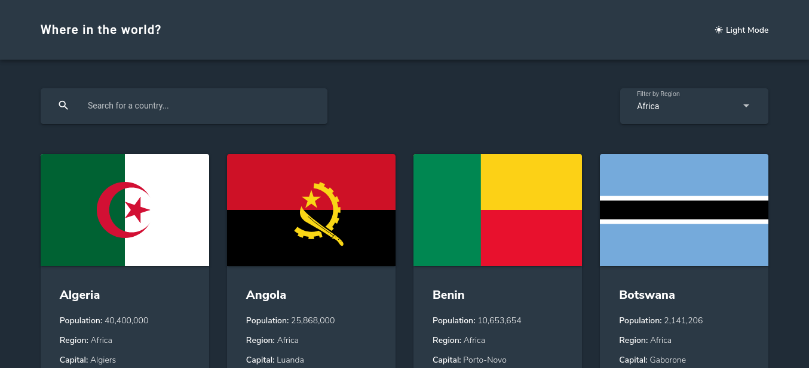
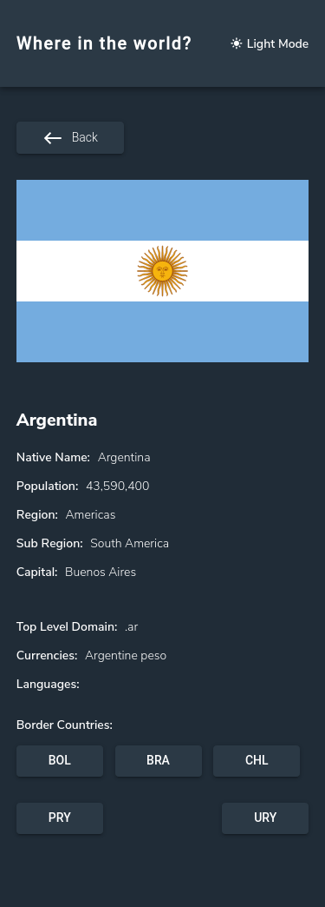

# Country finder

This is a solution to the [REST Countries API with color theme switcher challenge on Frontend Mentor](https://www.frontendmentor.io/challenges/rest-countries-api-with-color-theme-switcher-5cacc469fec04111f7b848ca). Frontend Mentor challenges help you improve your coding skills by building realistic projects.

## Table of contents

- [Overview](#overview)
  - [The challenge](#the-challenge)
  - [Screenshot](#screenshot)
  - [Links](#links)
  - [Built with](#built-with)
- [Author](#author)

## Overview

### The challenge

Users should be able to:

- See all countries from the API on the homepage
- Search for a country using an `input` field
- Filter countries by region
- Click on a country to see more detailed information on a separate page
- Click through to the border countries on the detail page
- Toggle the color scheme between light and dark mode *(optional)*

### Screenshot

#### Desktop View

#### Mobile View

### Links

- Solution URL: [https://github.com/darielmedr/REST-Countries-API-color-theme-angular](https://github.com/darielmedr/REST-Countries-API-color-theme-angular)
- Live Site URL: [https://darielmedr.github.io/REST-Countries-API-color-theme-angular](https://darielmedr.github.io/REST-Countries-API-color-theme-angular)

### Built with

- Semantic HTML5 markup
- SCSS custom properties
- Flexbox
- CSS Grid
- Mobile-first workflow
- [Angular](https://angular.io/) - Angular framework

## Author

- Frontend Mentor - [@darielmedr](https://www.frontendmentor.io/profile/darielmedr)
- GitHub - [@darielmedr](https://github.com/darielmedr)
- LinkedIn - [Dariel Medina Rodríguez](https://www.linkedin.com/in/darielmedr)
